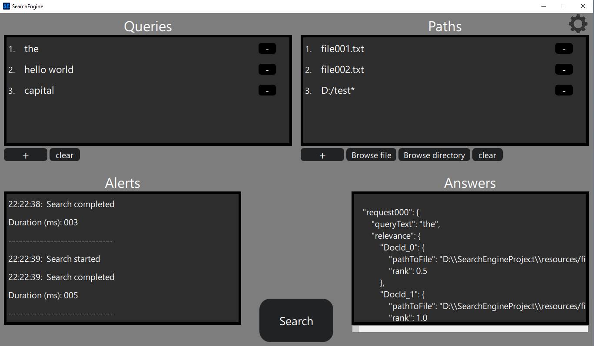

# SearchEngine
This search engine reads input queries and paths and creates a table with relevance index for each file in paths window.\
Relevance index is value which shows the probability of successful finding of the request to the user.
\
\
Search engine has a 2 run modes:
## Application mode
This is default run mode. \
But for switching Search engine to the application mode, you should go to `config.json` file in `jsonFiles` directory and set the `runMode` value to `application`:\

\
\
**Appearance** of `application` mode:

Advantages of `applciation` mode: 
- User-friendly and intuitive interface
- Allows user to input queries and paths without interaction with `.json` files

### Queries window

- `+` : add empty request
- `-` : delete particular request
- `clear` : delete all requests.

### Paths window

- `+` : add empty path
- `-` : delete particular path.
- `clear` : delete all paths.
- `Browse file` : choose local file with `.txt` extend
- `Browse directory` : choose local directory. 
	- If you add the `*` in the end of directory path, program will check all subdirectories on containing `.txt` files. (Defaultly `*` added to the end of path to directory)
	- If `*` isn't added to the end of directory path, program will check content only in pointed directory, without entering to subdirectories.

Also, **user can create a relative paths to files**, if they place in project directory `resources`.\
For example, `file001.txt` and `file002.txt` initially place in `resource` directory, consequently, user can point relative path to them.

### Answers window
\
That's a _read-only_ window, with no opportunity to edit. But has horizontal and vertical slider for navigation.

#### json Structure
If searching was successful, user can see the list of answers to requests with this structure:
```json
"request<ID>": {
    "queryText": "someText",
    "relevance": { // list of paths to files with the highest ranks
        "DocId_<ID>": {
            "pathToFile": "absolute/path/to/your/file.txt",
            "rank": 0.5
        },
        "DocId_<ID>": {
	        //the same
        }
    },
    "result": true // result has been found
},
```
If searching procces has been finished with no results, the `relevance` field won't exist:
``` json
"request002": {
	"queryText": "someText",
	"result": false // result has not been found
}
```

### Alert window
\
This window present the useful information for user:
1. Indicators of start and end of process with appropriate time.
2. Alerts which report to user about problems during the searching process.
3. The result duration of searching process.

And as a `Answer window` this is a _read-only_ window.

### Settings
To get there, click on the gear icon in the upper right corner of application:\

- **Max responses** - variable which responsible for the count of showed paths to files with highest ranks in `relevance` field.


## Console mode
For switching Search engine to the application mode, you should go to `config.json` file in `jsonFiles` directory and set the `runMode` value to `console`:\
 

### Console mode actions consequence
In `console` mode, program do only these steps and ultimately close:
- Read **queries** from `requests.json` 
- Read **paths** and **max_responses** variable from `config.json`
- Search answers
- Write answers in `answers.json`.

### Editing json files 
- For Inputting new paths to files, open the `config.json` file in `jsonFiles` directory and enter new paths into `paths` array. Feature with `*` from `Paths window` works the same way.
- For inputting new queries , open the `requests.json` file in `jsonFiles` directory and enter new queries into the `requests` array.


## Required Tools
To set up and work on this project, you will need the following tools:

1. **C++**
   - **Standard**: 17 or higher
   - **Purpose**: for `filesystem` and modern features 
   - **Installation**: [Download and install C++](https://www.geeksforgeeks.org/complete-guide-to-install-c17-in-windows/)

2. **CMake**
   - **Version**: 3.14 or higher
   - **Purpose**: Safe version to ensure compability with FetchContent, Qt6 and modern C++ standards. 
   - **Installation**: [Donwload and install CMake](https://cmake.org/download/)

3. Qt
   - **Version**: 6.5 or higher 
   - **Purpose**: for modern features
   - **Installation**: [Donwload and install Qt](https://www.qt.io/download-dev)
